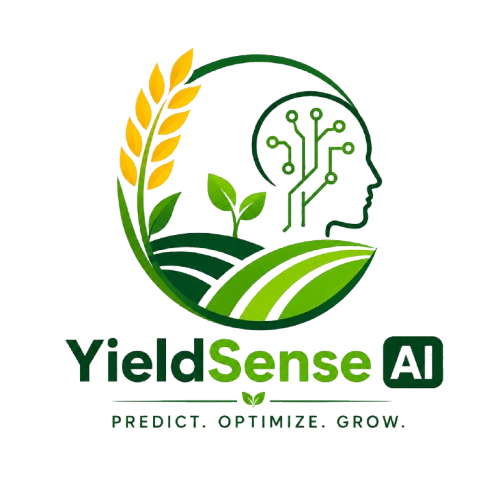

<div align="center">



# YieldSense AI

### AI-Powered Crop Yield Prediction &amp; Agricultural Productivity Forecasting System

A full-stack agricultural intelligence platform that combines Machine Learning, real-time weather data, soil information, historical weather analysis, and Google Gemini to support data-driven crop yield forecasting.

[](https://react.dev/)
[](https://fastapi.tiangolo.com/)
[](https://www.postgresql.org/)
[](https://scikit-learn.org/)
[](https://ai.google.dev/)
[](#license)

</div>

---

## About This Project

I built **YieldSense AI** to bring together everything a farmer or agricultural stakeholder needs to make an informed decision about crop yield, in one place. Instead of relying on scattered weather reports, soil test results, and guesswork, this platform pulls live weather data, soil composition, and historical agricultural trends, runs it through a trained Machine Learning model, and then layers Google Gemini on top to translate raw predictions into practical, human-readable advice.

It started as an exploration into how far a Random Forest model could be pushed on real agricultural data, and grew into a full-stack product with authentication, farm management, an admin dashboard, and an end-to-end prediction pipeline — the project you see here today.

---

## Table of Contents

- [Overview](#overview)
- [Key Features](#key-features)
- [System Architecture](#system-architecture)
- [Prediction Workflow](#prediction-workflow)
- [Machine Learning](#machine-learning)
- [Dataset](#dataset)
- [Tech Stack](#tech-stack)
- [Project Structure](#project-structure)
- [Installation & Setup](#installation--setup)
- [Frontend Setup](#frontend-setup)
- [API Overview](#api-overview)
- [Security Notes](#security-notes)
- [Current Capabilities](#current-capabilities)
- [Future Enhancements](#future-enhancements)
- [Development](#development)
- [Contributors](#contributors)
- [License](#license)

---

## Overview

**YieldSense AI** is a full-stack smart agriculture application designed to help farmers and agricultural stakeholders estimate crop yield and understand the factors affecting productivity.

The system brings together:

- Machine Learning for crop-yield prediction
- Weather data based on farm coordinates
- Soil information including N, P, K and pH
- Historical weather analysis from the project's agricultural dataset
- Google Gemini AI for practical agricultural insights
- JWT-based authentication
- Google Sign-In / Sign-Up
- Farm management
- Administrator dashboard and analytics
- Prediction history and recent activity

The project is implemented as a **React + Vite frontend** with a **FastAPI backend**, **PostgreSQL database**, and a pre-trained ML model.

---

## Key Features

### Crop Yield Prediction
Users can submit crop and farm information such as:

- Crop
- Season
- Farm area
- Fertilizer usage
- Pesticide usage
- Farm coordinates

The backend enriches this information with weather and soil data before sending it to the trained ML model.

### Weather Intelligence

The prediction workflow uses weather information including:

- Average temperature
- Total rainfall
- Average humidity
- State/location information

The application also performs **historical weather analysis** using `YieldSense_datasets.csv` for the selected crop, state, and season.

### Soil Analysis

The system uses soil parameters such as:

- Nitrogen (N)
- Phosphorus (P)
- Potassium (K)
- pH
- Soil health information

These values are included in the prediction and agricultural analysis workflow.

### Gemini Agricultural AI

After the ML prediction, the application sends the farm context to **Google Gemini (`gemini-2.5-flash`)** to generate a structured agricultural report.

The report can include:

- Best crop
- Crop reasoning
- Soil analysis
- Weather analysis
- Fertilizer advice
- Irrigation advice
- Pest risk
- Yield analysis
- Productivity tips
- Summary

> Gemini is used as an advisory layer; the actual yield value is generated by the trained ML model.

### Authentication & Authorization

The backend supports:

- Email/password signup
- Email/password login
- Password hashing with bcrypt
- JWT access tokens
- Google OAuth login/signup
- Protected routes
- Role-based navigation

### Farm Management

Users can create, view, update, and delete farm records through the farm-management API and frontend components.

### Admin Dashboard

The project includes administrative functionality for:

- Farmer management
- Dataset management
- Prediction logs
- Analytics
- Recent prediction activity
- Most-predicted crop
- Most-active state

---

## System Architecture

```text
                    ┌─────────────────────────┐
                    │       React Frontend    │
                    │      Vite + React 19    │
                    └────────────┬────────────┘
                                 │
                                 │ REST API
                                 ▼
                    ┌─────────────────────────┐
                    │      FastAPI Backend    │
                    │      Python REST API     │
                    └────────────┬────────────┘
                                 │
             ┌───────────────────┼───────────────────┐
             │                   │                   │
             ▼                   ▼                   ▼
      ┌─────────────┐    ┌──────────────┐    ┌──────────────┐
      │ ML Model    │    │ PostgreSQL   │    │ External AI  │
      │ Random      │    │ Database     │    │ Gemini API   │
      │ Forest      │    │              │    │              │
      └─────────────┘    └──────────────┘    └──────────────┘
             │
             ▼
      ┌─────────────────────────────┐
      │ Weather + Soil + Historical │
      │ Agricultural Data            │
      └─────────────────────────────┘
```

---

## Prediction Workflow

```text
User enters farm information
            ↓
Frontend sends prediction request
            ↓
Backend obtains weather information
            ↓
Historical weather analysis
            ↓
Soil information lookup
            ↓
Crop / Season / State encoding
            ↓
Feature preparation
            ↓
Trained ML model
            ↓
Predicted Yield
            ↓
Estimated Production = Yield × Farm Area
            ↓
Gemini agricultural analysis
            ↓
Prediction + recommendations shown to user
```

---

## Machine Learning

The repository contains a trained crop-yield prediction model:

```text
ml/crop_yield_model.pkl
```

The backend loads the trained model together with categorical encoders:

```text
ml/crop_encoder.pkl
ml/season_encoder.pkl
ml/state_encoder.pkl
```

The prediction API prepares model features including:

| Feature | Description |
|---|---|
| Crop | Selected crop |
| Year | Current year |
| Season | Selected agricultural season |
| State | Farm state |
| Area | Farm area |
| Fertilizer | Fertilizer usage |
| Pesticide | Pesticide usage |
| Temperature | Weather temperature |
| Rainfall | Weather rainfall |
| Humidity | Weather humidity |
| N | Soil nitrogen |
| P | Soil phosphorus |
| K | Soil potassium |
| pH | Soil pH |

The prediction service uses the trained model to estimate yield and then calculates:

```text
Estimated Production = Predicted Yield × Farm Area
```

The repository also contains the training notebook:

```text
ml/YieldSense_AI_.ipynb
```

---

## Dataset

The project includes agricultural data under the `ml` and `backend/data` directories.

### Main ML dataset

```text
ml/crop_yield.csv
```

Dataset rows available in the repository: **19,689** (excluding the header).

### Historical weather dataset

```text
backend/data/YieldSense_datasets.csv
```

This dataset is used by the backend for historical analysis based on:

- Crop
- State
- Season
- Year
- Average temperature
- Total rainfall
- Average humidity

The backend cleans text and numeric columns and calculates historical averages and weather stability information where matching records are available.

---

## Tech Stack

### Frontend

| Technology | Purpose |
|---|---|
| React 19 | UI development |
| Vite | Frontend build tool |
| React Router | Application routing |
| Axios | API communication |
| Recharts | Charts and analytics |
| Lucide React | UI icons |
| Google OAuth | Google authentication |

### Backend

| Technology | Purpose |
|---|---|
| Python | Backend / ML ecosystem |
| FastAPI | REST API |
| SQLAlchemy | ORM |
| PostgreSQL | Relational database |
| Pydantic | Data validation |
| JWT | Authentication |
| Passlib + bcrypt | Password hashing |
| Pandas | Data processing |
| NumPy | Numerical processing |
| Scikit-learn | Machine Learning |
| Joblib | Model serialization |
| Requests | External API communication |
| Google Gemini API | Agricultural AI insights |

### Infrastructure

- Docker Compose
- PostgreSQL 16
- REST API architecture

---

## Project Structure

```text
Crop-Yield-Prediction-Agricultural-Productivity-Forecasting-System/
│
├── backend/
│   ├── app/
│   │   ├── api/
│   │   │   └── v1/
│   │   │       ├── admin.py
│   │   │       ├── auth.py
│   │   │       ├── farm.py
│   │   │       └── prediction.py
│   │   │
│   │   ├── core/
│   │   │   ├── config.py
│   │   │   ├── deps.py
│   │   │   ├── gemini.py
│   │   │   ├── model_loader.py
│   │   │   ├── security.py
│   │   │   ├── soil.py
│   │   │   ├── weather.py
│   │   │   └── weather_analysis.py
│   │   │
│   │   ├── db/
│   │   ├── models/
│   │   ├── schemas/
│   │   └── main.py
│   │
│   └── data/
│       ├── YieldSense_datasets.csv
│       └── state_soil_data.csv
│
├── frontend/
│   ├── src/
│   │   ├── components/
│   │   ├── pages/
│   │   ├── services/
│   │   ├── assets/
│   │   └── styles/
│   ├── package.json
│   └── vite.config.js
│
├── ml/
│   ├── crop_yield.csv
│   ├── YieldSense_AI_.ipynb
│   ├── crop_yield_model.pkl
│   ├── crop_encoder.pkl
│   ├── season_encoder.pkl
│   └── state_encoder.pkl
│
├── docker-compose.yml
├── requirements.txt
└── .gitignore
```

> The repository also contains local virtual-environment/build artifacts. These should generally **not** be committed to GitHub; use `.gitignore` to exclude them.

---

## Installation & Setup

### 1. Clone the repository

```bash
git clone <YOUR_GITHUB_REPOSITORY_URL>
cd Crop-Yield-Prediction-Agricultural-Productivity-Forecasting-System
```

### 2. Backend setup

Create and activate a Python virtual environment:

**Windows**

```bash
python -m venv venv
venv\Scripts\activate
```

**Linux / macOS**

```bash
python3 -m venv venv
source venv/bin/activate
```

Install dependencies:

```bash
pip install -r requirements.txt
```

### 3. Configure environment variables

Create/update the backend environment configuration with your own credentials.

Important values include:

```env
GEMINI_API_KEY=your_gemini_api_key
```

Do **not** commit real API keys, passwords, or secrets to GitHub.

The current project also contains database configuration in the backend code, so production deployment should move these credentials into environment variables.

### 4. Start PostgreSQL

The project includes a Docker Compose configuration for PostgreSQL 16.

```bash
docker compose up -d
```

Verify that the PostgreSQL container is running:

```bash
docker compose ps
```

### 5. Start the FastAPI backend

From the project root:

```bash
uvicorn backend.app.main:app --reload
```

Depending on your Python path/setup, you may instead run the backend from the `backend` directory:

```bash
cd backend
uvicorn app.main:app --reload
```

The API should then be available through the configured local backend port.

FastAPI also provides interactive API documentation at:

```text
/docs
```

---

## Frontend Setup

Open a new terminal:

```bash
cd frontend
```

Install dependencies:

```bash
npm install
```

Start the development server:

```bash
npm run dev
```

Vite will provide the local frontend URL, typically:

```text
http://localhost:5173
```

### Production build

```bash
npm run build
```

Preview the production build:

```bash
npm run preview
```

---

## API Overview

The FastAPI backend exposes the following major route groups:

| Route | Purpose |
|---|---|
| `/api/v1/auth` | Signup, login, Google authentication, current user |
| `/api/v1/farms` | Farm creation and management |
| `/api/v1/prediction` | Metadata and crop-yield prediction |
| `/api/v1/admin` | Administrative analytics and farmer management |
| `/health` | Backend health check |
| `/` | API welcome endpoint |

### Health check

```http
GET /health
```

Expected response:

```json
{
  "status": "ok"
}
```

---

## Security Notes

Before deploying this application publicly:

- Move `DATABASE_URL` into environment variables.
- Replace the development JWT secret with a strong secret.
- Never commit `.env` files containing real credentials.
- Configure production CORS origins.
- Protect administrator endpoints with proper role checks.
- Use HTTPS in production.
- Rotate API keys if they are accidentally exposed.

---

## Current Capabilities

The project currently provides an end-to-end flow from farm input to agricultural insight:

**Farm Data → Weather → Soil → ML Prediction → Production Estimate → AI Agricultural Report**

It also provides supporting application functionality such as authentication, farm records, prediction logs, analytics, and role-aware dashboards.

---

## Future Enhancements

Potential improvements for future versions include:

- Responsive mobile-first farmer application
- Interactive farm maps
- More advanced weather forecasting
- Satellite/remote-sensing crop monitoring
- IoT-based soil and field sensors
- Model performance monitoring
- Automated model retraining
- Hyperparameter optimization and model comparison
- Multi-language support for farmers
- Cloud deployment
- Personalized recommendations based on farm history
- Weather and crop-risk alerts
- Explainable AI for prediction factors

---

## Development

### Frontend linting

```bash
cd frontend
npm run lint
```

### Frontend production build

```bash
npm run build
```

### Backend API documentation

Run FastAPI and open:

```text
/docs
```

---

## Contributors

**Prince Kumar** — Creator & Developer

I designed, built, and continue to maintain YieldSense AI end-to-end: the ML pipeline, the FastAPI backend, and the React frontend.

> If others join this project, they'll be added here once the final contributor list is confirmed.

---

## License

No explicit license file was found in the supplied project repository.

If this project is intended for public open-source use, add a suitable `LICENSE` file before publishing.

---

## Project Summary

With YieldSense AI, my goal was to make agricultural decision-making more data-driven — combining machine learning predictions with weather, soil, historical agricultural information, and generative AI recommendations in one platform.

```text
Farm Data
   ↓
Weather + Soil
   ↓
Machine Learning
   ↓
Yield Prediction
   ↓
Gemini Agricultural Insights
   ↓
Smarter Agricultural Decisions
```

<div align="center">

**YieldSense AI — Turning Agricultural Data into Actionable Insights**

<sub>Built with care by Prince Kumar</sub>

</div>